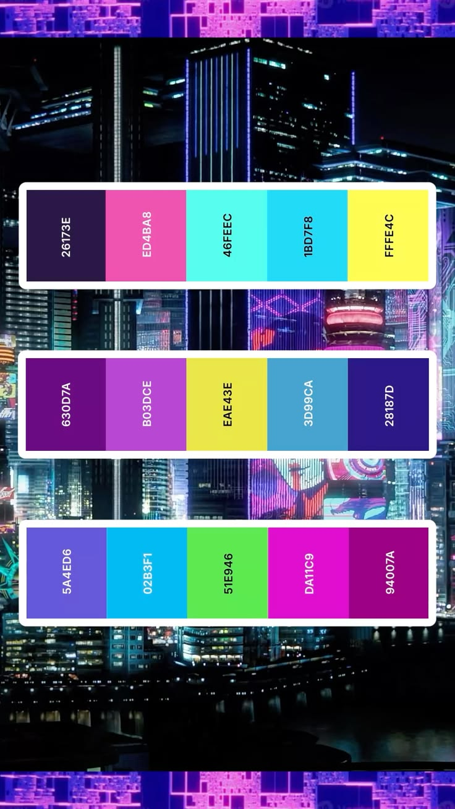

# Omarchy Cyberpunk Edgerunners Theme

Cyberpunk Edgerunners is a dark futuristic Omarchy theme inspired by Studio Trigger and CD Projekt Red's *Cyberpunk: Edgerunners*, featuring iconic neon yellow, luminous cyan, and hot pink accents against a deep Night City dark purple void (`#26173E`).

## Preview



## Install

### Complete local install (Recommended)
For a complete install with automatic backups, VS Code theme extension synchronization, transparent background window rules, and a clean uninstall path, run:

```bash
./install.sh
```

- Installs Cyberpunk Edgerunners as an Omarchy theme matching official template specifications.
- Configures Kitty, Ghostty, Alacritty, and Foot with clean transparent backgrounds (`background_opacity 0.80`).
- Configures Hyprland with chromatic border gradients (`#FFFF4C` -> `#ED4BA8` -> `#1BD7F8`) and transparency rules for editors and apps.
- Automatically generates and synchronizes the rich Cyberpunk Edgerunners color theme extension for VS Code / Cursor / VSCodium.
- Creates automatic backups of previous theme, wallpaper, and editor settings.

Restore previous configuration at any time with:

```bash
./uninstall.sh
```

## What's Included

- **Hyprland Window Rules**: Window transparency rules (`0.80` active, `0.75` inactive) for VS Code, Cursor, VSCodium, Antigravity IDE, GitHub Desktop, Obsidian, Zed, Discord, Slack, Telegram, Spotify, and Nautilus.
- **Terminals**: Clean transparent background configurations (`0.80` opacity) for Kitty, Alacritty, Ghostty, Foot, and Warp.
- **TUIs & Monitors**: Native transparent terminal backgrounds and custom gradient styling for `btop`, `cava`, `helix`, and `neovim`.
- **VS Code / Cursor / VSCodium**: Full multi-color syntax highlighting (`vscode-theme.json`) covering TextMate scopes and semantic tokens:
  - **Keywords & Control Flow**: `#ED4BA8` (Lucy Hot Pink)
  - **Functions & Methods**: `#FFFF4C` (Cyberpunk Neon Yellow)
  - **Types & Interfaces**: `#B03DCE` (Neon Orchid)
  - **Strings**: `#51E946` (Toxic Neon Green)
  - **Variables & Parameters**: `#1BD7F8` (Electric Cyan)
  - **Numbers & Constants**: `#EAE43E` (Acid Lime Yellow)
  - **Comments**: `#3D99CA` (Steel Blue)
- **Editors & TUIs**: Native configurations for Neovim (`aether.nvim` v3 with LazyVim), Helix, Zed, Pi, and Claude CLI.
- **Desktop Integrations**: Styled layouts for Waybar, Mako, Walker, SwayOSD, and Hyprlock.
- **Vencord Theme**: Standalone [Vencord theme](vencord.theme.css) with custom layered treatment for Discord.

## Requirements

- Omarchy 4.0 (Quattro) for native shell and Hyprland Lua treatment
- `Yaru-magenta` icon theme
